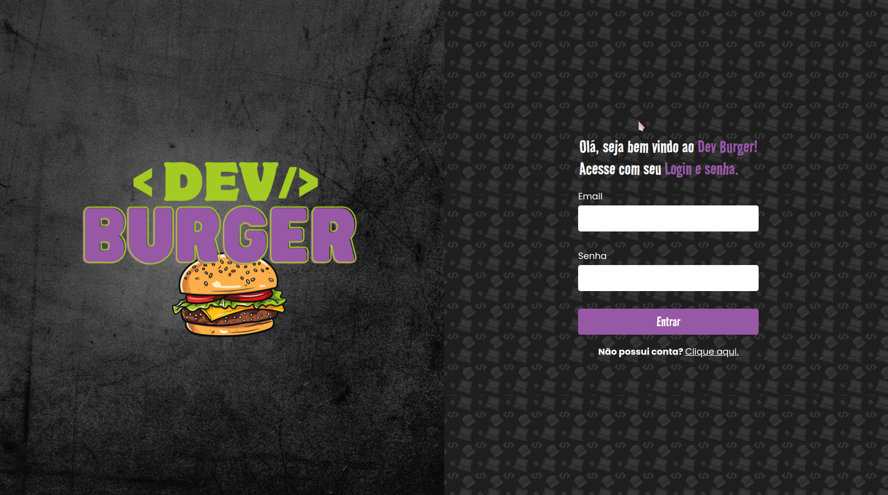
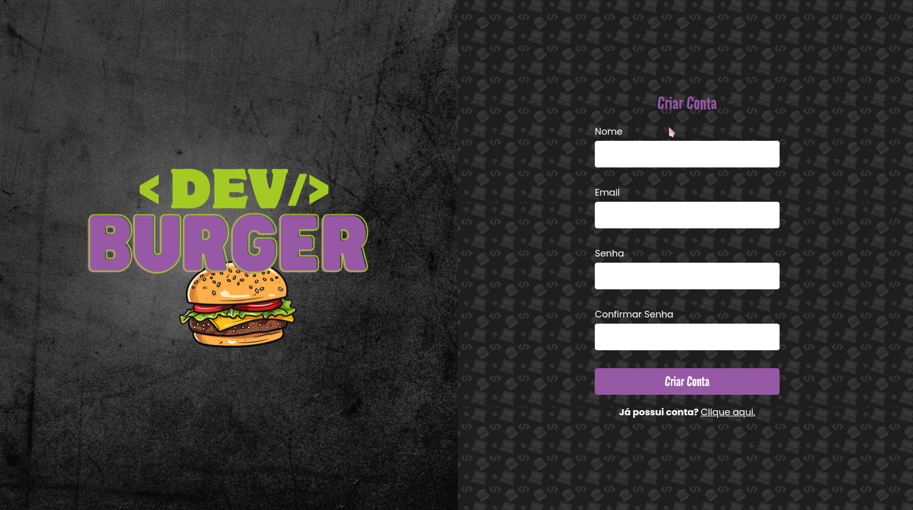
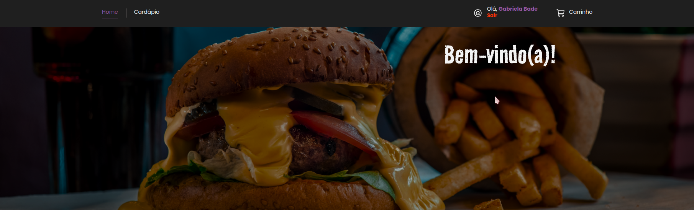
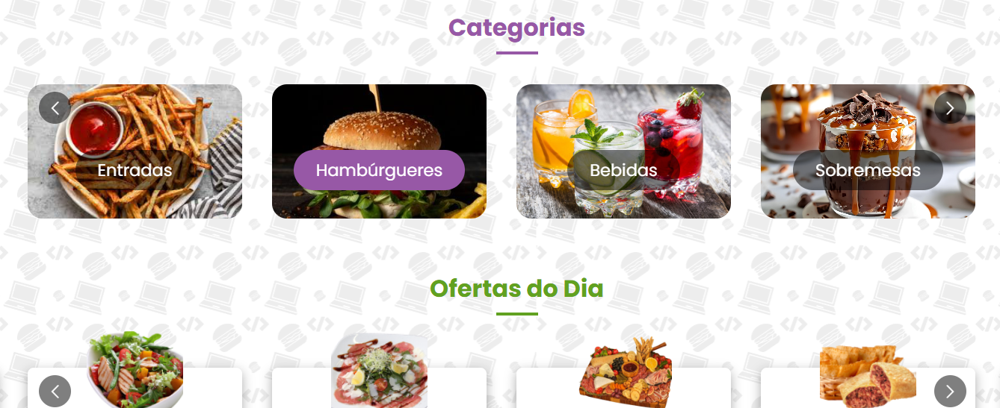
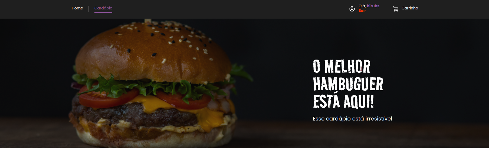
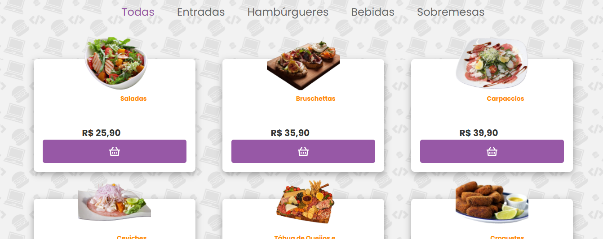
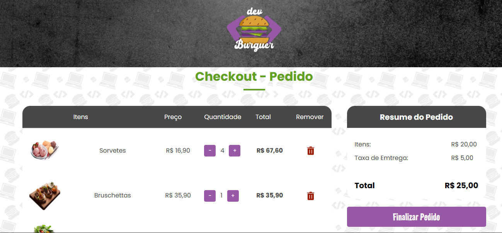

# DevBurger Backend

Este é o repositório do **Backend** do projeto **DevBurger**. Esta API fornece endpoints para gerenciar usuários, categorias, produtos e pedidos. e integração com o frontend.

## Tecnologias Utilizadas

- Node.js  
- Express  
- MongoDB  
- Sequelize  
- Docker  

---

## Configuração do Ambiente

1. Clone o repositório:  
   ```bash
   git clone https://github.com/gabrielabade/devburger-api
2. Acesse a pasta do projeto:
   ```bash
   cd devburger-api
3. Instale as dependências:
   ```bash
   yarn install
4. Configure as variáveis de ambiente no arquivo ```.env```:
   ```bash
   PORT=3002  
   MONGO_URI=sua-string-de-conexão
5. Execute o projeto em ambiente local:
   ```bash
   yarn dev
## Configuração  com Docker
1. Suba os containers com o Docker Compose:
   ```bash
   docker-compose up -d
2. Caso esteja utilizando Linux, defina a plataforma padrão:
   ```bash
   DOCKER_DEFAULT_PLATFORM=linux/amd64
3. Execute as migrations do banco de dados:
   ```bash
   npx sequelize db:migrate
4. Inicie a aplicação:
   ```bash
   yarn dev

# Endpoints da API

## Usuários

### Criar Usuário
```bash
curl 'http://localhost:3002/users' \
--header 'Content-Type: application/json' \
--data-raw '{
  "name": "John Doe",
  "email": "john@example.com",
  "password": "password123"
}'
```

### Criar Usuário Administrador
```bash
curl 'http://localhost:3002/users' \
--header 'Content-Type: application/json' \
--data-raw '{
  "name": "Admin User",
  "email": "admin@example.com",
  "password": "adminpass123",
  "admin": "True"
}'
```

---

## Autenticação

### Criar Sessão
```bash
curl 'http://localhost:3002/sessions' \
--header 'Content-Type: application/json' \
--data-raw '{
  "email": "john@example.com",
  "password": "password123"
}'
```

---

## Categorias

### Listar Categorias
```bash
curl 'http://localhost:3002/categories' \
--header 'Authorization: Bearer {{token}}'
```

### Criar Categoria
```bash
curl 'http://localhost:3002/categories' \
--header 'Authorization: Bearer {{token}}' \
--form 'file=@"/path/to/image.jpg"' \
--form 'name="Category Name"'
```

### Atualizar Categoria
```bash
curl --request PUT 'http://localhost:3002/categories/1' \
--header 'Authorization: Bearer {{token}}' \
--form 'file=@"/path/to/new-image.jpg"' \
--form 'name="Updated Category Name"'
```

---

## Produtos

### Listar Produtos
```bash
curl 'http://localhost:3002/products'
```

### Criar Produto
```bash
curl 'http://localhost:3002/products' \
--header 'Authorization: Bearer {{token}}' \
--form 'name="Product Name"' \
--form 'description="Product Description"' \
--form 'price="19.99"' \
--form 'category_id="1"' \
--form 'file=@"/path/to/product-image.jpg"'
```

### Atualizar Produto
```bash
curl --request PUT 'http://localhost:3002/products/1' \
--header 'Authorization: Bearer {{token}}' \
--form 'name="Updated Product Name"' \
--form 'description="Updated Product Description"' \
--form 'price="29.99"' \
--form 'file=@"/path/to/updated-product-image.jpg"'
```

---

## Pedidos

### Listar Pedidos
```bash
curl 'http://localhost:3002/orders' \
--header 'Authorization: Bearer {{token}}'
```

### Criar Pedido
```bash
curl 'http://localhost:3002/orders' \
--header 'Content-Type: application/json' \
--header 'Authorization: Bearer {{token}}' \
--data '{
  "products": [
    {
      "id": 1,
      "quantity": 2
    },
    {
      "id": 2,
      "quantity": 1
    }
  ]
}'
```

### Atualizar Status do Pedido
```bash
curl --request PUT 'http://localhost:3002/orders/ORDER_ID' \
--header 'Content-Type: application/json' \
--header 'Authorization: Bearer {{token}}' \
--data '{
  "status": "Delivered"
}'
```

## Navegação para o Frontend

O repositório do frontend pode ser encontrado aqui:  
[DevBurger Frontend](https://github.com/gabrielabade/devburger-interface)

## Preview do Projeto

### Tela de Login  


### Tela de Cadastro  


### Página Inicial  
  


### Cardápio  



### Carrinho e Resumo do Pedido  


---